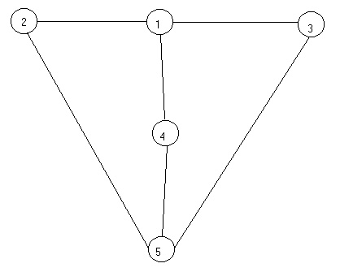

# Graph Coloring

A C program that colours an undirected graph, written as a university assignment and kept here
as it was handed in. The dates on the submission's own files run from 31 December 2001 to
23 January 2002. A colouring assigns a label to every vertex so that no edge has the same label
at both ends; a minimum colouring uses as few labels as it can. The program finds one of each:
a colouring by a greedy rule, which is the default, and the minimum colouring by exhaustive
search, under `-best`.

Nothing about the algorithm has changed. What the 2026 pass did was replace the Dev-C++ project
with a real build, clear the compiler warnings and add a test that pins the output; the details
are in [What changed in 2026](#what-changed-in-2026). The files as they were submitted are the
first commit here, so `git show $(git rev-list --max-parents=0 HEAD):src/calc.c` returns any of
them.

## Build and run

C99 and a libm; no other dependency, and the Makefile is portable make.

```sh
make            # ./mapColoring, built warning-free under -Wall -Wextra -Wstrict-prototypes
make test       # run the supplied graphs and compare against tests/expected/
./mapColoring maps/map.12
./mapColoring maps/map.12 -best
```

Objects land in `build/` with their header dependencies generated, so a touched header rebuilds
what includes it. Everything is overridable from the command line, and `make install` honours
the usual variables:

```sh
make CC=gcc OPT=-O0
make install DESTDIR=/tmp/stage PREFIX=/usr/local
make help       # the full list of targets and variables
```

`make test` runs `tests/run.sh`, which puts the three graphs it can finish through both searches
and diffs the result against recorded output, and checks the help text and the exit status for a
missing file. Those recordings came off the sources **as submitted**, which is what makes them
worth having: they are the evidence that the 2026 pass changed nothing a user can see.

The `-best` flag is read only when it is the *only* argument after the file name, so
`./mapColoring maps/map.12 -best extra` runs the greedy search, and so does any spelling other
than `-best`. There is no error for an unknown option.

## The input format

A count of vertices on the first line, then one edge per line as a pair of vertex numbers,
counting from 1:

```
5
1 2
1 3
1 4
2 5
3 5
4 5
```

Edges are undirected and duplicates are dropped, so listing an edge in both directions is
harmless; `maps/map.5` does exactly that, and the six edges above are what the program ends up
with. Whitespace is whitespace, so several pairs may share a line, and reading stops at the
first line that is not a pair of numbers. A file whose first line is not a vertex count is
rejected outright. The input is otherwise trusted: a vertex number above the declared count
indexes past the end of the vertex array rather than being rejected.



`maps/convert.pl` turns one of these files into a Graphviz `dot` graph, and `maps/Makefile`
runs it over every map and renders a GIF from each. Both came with the 2004 binary release.

```sh
make graphs          # needs perl and Graphviz's dot
```

## What it prints

```
$ ./mapColoring maps/map.12
loading data ... done
Number of nodes: 12
Number of combinations: 4096
Solving problem ... please wait
Greedy selected

Number of colors: 3
Nodes with common color: 1 3 6 7 8 9 12
Nodes with common color: 2 4 5 11
Nodes with common color: 10
```

One line per colour, listing the vertices that carry it. `-best` prints the same thing under
a `Colors:` heading, and for this map it also finds three, though it splits them differently:
`1 3 6 7 8 9 12`, `2 10`, `4 5 11`.

## The equation behind it

The assignment was handed in with a write-up, in Greek, and it sets the problem out before any
of the code does. A graph is a pair of finite sets G = (V, E): V holds the vertices, E the
edges, and an edge stands for a relation between the two things its ends represent — the example
it opens with is countries, and an edge between two of them means they share a border.
Colouring it means giving every vertex a label such that no vertex carries the same label as a
neighbour.

The method is the part worth keeping. Rather than reason about colours, the write-up turns the
graph into a Boolean equation and solves that. Every vertex becomes a variable, every edge
between i and j becomes the clause `(xi' OR xj')` — at most one end of an edge may be in — and
the equation is all of those clauses ANDed together. Take three vertices joined pairwise:

```
f(x1, x2, x3) = (x1' OR x2') AND (x2' OR x3') AND (x3' OR x1')
```

That is satisfied at `100`, `010` and `001` and nowhere else, so no two of the three can share a
colour, which is what you would expect of a triangle. A satisfying assignment is exactly a set
of vertices with no edge inside it — an independent set, a group that may all take the same
colour — and finding them all means trying all 2<sup>n</sup> assignments. There is no shortcut
in the write-up and there is none in the program; the whole of it is in that sentence.

`maps/map.5` is the worked example. Its equation is

```
f(x1, x2, x3, x4, x5) = (x1' OR x2') AND (x1' OR x3') AND (x1' OR x4')
                    AND (x4' OR x5') AND (x5' OR x2') AND (x5' OR x3')
```

and it has ten solutions: `10000`, `10001`, `01000`, `01010`, `01110`, `01100`, `00100`,
`00110`, `00010`, `00001`. Those ten are the independent-set count for that row of the table
below. The all-zero assignment satisfies the equation too and is thrown away, since colouring
nothing is not a colour.

With the ten in hand, the question becomes which of them to pick, and the write-up gives two
answers — an exhaustive one and a greedy one:

```
Algorithm GraphColoring
INPUT:  S, the solutions of the equation; N, how many there are
OUTPUT: L, the colouring with the fewest colours

for I = 1 to N - 1
    recursive_solution(I, new_list(I), 1)

routine recursive_solution(C, L_rs, L_c)
    if is_solution(L_rs) then
        if L_n > L_c then L = L_rs
        return
    for k = C + 1 to N
        if has_no_common(L_rs, S(k)) then
            recursive_solution(k, append_list(L_rs, L_c, k), L_c + 1)

Algorithm GraphColoring_Greedy
OUTPUT: L, a colouring

L = new_list(null)
while not is_solution(L)
    K = find_max(L, S)
    L = append_list(L, K)
```

`is_solution` asks whether the sets chosen so far cover every vertex, `has_no_common` whether a
candidate overlaps them, and `find_max` hands back the largest one that does not. Those names
are still in the C, twenty-four years later: `recursive_solve`, `is_solution`, `append_list`,
`find_max_solution`. The pseudocode was written first and the program was typed from it.

Two slips in the listing are the document's own. The greedy loop is written
`While( is_solution(L) )` where it has to be *while not*, and that one is corrected above
because reproducing it would just read as an error. The exhaustive loop's `for I = 1 to N - 1`
is off by one against `get_best_solution`, which runs `0` to `N - 1` over a zero-based list —
1 to N — and that one is left as the document has it. The C is what was built; the listing is
what was written first.

## How it works

Three stages, and the first one is the expensive one.

**Every subset of the vertices is generated and tested.** `make_combinations` in
[src/calc.c](src/calc.c) walks the subsets by flipping one vertex in or out at a time, which is
the equation above being evaluated one assignment at a time; `calculate_function` is that
conjunction of clauses, written out as a loop over the edge list:

```c
result = result && ((!node_array[r_node->from - 1]) || (!node_array[r_node->to - 1]));
```

with `sum == 0` above it rejecting the empty set. Every independent set it finds is copied into
a linked list. The "Number of combinations" line reports 2<sup>n</sup> and the walk tests
2<sup>n</sup>−1 subsets, the empty one being the odd man out; both were counted by
instrumenting `decide`.

**The greedy search covers the graph with those sets.** Take the largest independent set, then
repeatedly take the largest one that does not touch any vertex already coloured, until every
vertex is coloured. The number of sets used is the number of colours.

**`-best` searches the covers exhaustively.** `recursive_solve` tries every combination of
independent sets and keeps the smallest one that covers the graph, so its answer is the
chromatic number rather than an estimate.

### The greedy rule can overshoot, and here is why

Greedy and exhaustive agree on all four maps in `maps/`. They do not agree in general, and the
reason is worth stating because it is not the usual one about greedy algorithms being unlucky.
Once a vertex has a colour, a candidate set containing that vertex is rejected *whole*. The
program never uses part of an independent set, so a set that would colour three of the vertices
still waiting is thrown away because it also contains one that is already done.

A nine-vertex graph found by search shows it:

```
9
1 2  1 3  1 5  1 6  1 8  1 9
2 3  2 4  2 5  2 6  2 7
3 4  3 5  3 7  3 8  3 9
4 5  4 6  4 7  4 8  4 9
5 7  5 8  5 9
6 7  6 9
7 9
8 9
```

Greedy reports six colours; `1 7`, `2 9`, `3 6`, and then `4`, `5` and `8` on their own.
`-best` reports five: `1 4`, `2 9`, `3`, `5 6`, `7 8`. Five is the chromatic number of that
graph.

## The maps

Four graphs were handed in with the assignment.

| file | vertices | edges | planar | colours needed | independent sets |
| --- | --- | --- | --- | --- | --- |
| `map.5` | 5 | 6 | yes | 2 | 10 |
| `map.7` | 7 | 8 | yes | 2 | 27 |
| `map.12` | 12 | 32 | **no** | 3 | 154 |
| `map.109` | 109 | 321 | yes | 4 | — |

Edges are counted after duplicates are dropped; the independent-set column is what the first
stage keeps. Planarity and the colour counts were checked separately, with NetworkX and a
backtracking colourer, not with this program.

Two of those rows are worth a second look. `map.12` is not planar, so despite the assignment's
name it is not the colouring of any map. And `map.109` has exactly 3 × 109 − 6 = 321 edges,
which is the most a planar graph on 109 vertices can have: it is a triangulation, and it needs
all four colours. It is the one input here that makes the four-colour theorem tight, and it is
also the one this program can never finish.

## Where it stops

`./mapColoring maps/map.109` prints

```
Number of nodes: 109
Number of combinations: 649037107316853453566312041152512
Solving problem ... please wait
```

and then runs until something stops it. The first stage is 2<sup>n</sup>, with no way out.

Measured on an Apple M4 Max, over cycle graphs so that the size is the only thing changing:
0.07 s at 24 vertices, 1.34 s at 28, 18.91 s at 32, which is four times the work for every two
vertices added, as it should be. Carrying that on, 109 vertices is 2<sup>77</sup> times the
32-vertex run, or around 10<sup>17</sup> years. The universe is about 1.4 × 10<sup>10</sup> years
old.

`docs/20minutes.txt` is a one-line file from the time, containing the number `89132660` and
nothing else. Twenty minutes of the 2002 machine, at a guess, and roughly what it got through.
That is 2<sup>26.4</sup>, so twenty-six vertices was about as far as an afternoon's patience
went. The machine above does the same 2<sup>26</sup> in 0.29 s, and twenty minutes of it would
reach thirty-eight. Twenty-four years of hardware bought twelve vertices.

The exhaustive search on top of that is cheap by comparison but not free: `-best` on `map.12`
takes 0.07 s against a greedy run too short to measure, over 154 independent sets.

## What changed in 2026

The original build was `original/mapColoring.dev`, a Dev-C++ project naming
`D:\Projects\mapColoring` and an icon at `D:\DEVC++\Icon\MAINICON.ICO`. It built on one
machine, in 2002. Replacing it left a choice between silencing the warnings a real build turns
on and clearing them, and clearing them is what happened.

**Seven changes.** None of them alters an answer, and `tests/expected/` is the proof rather
than the claim: the recordings were taken from the sources as submitted, and the current binary
still matches them byte for byte.

| Where | What |
| --- | --- |
| `calc.h`, `vector.h`, `vector_solutions.h` | `#endif _CALC_H_` and friends, with the guard name left bare after the directive. Now a comment. |
| `calc.h`, `calc.c` | `print_node_array()` declared with empty parentheses, which is not a prototype and is gone from C23. Now `(void)`. |
| `main.c` | `parse_file` kept `add_node`'s return value in `last_node` and never read it. |
| `calc.c` | `get_best_solution` declared `int *tmp` and never used it. |
| `vector_solutions.c` | `find_max_solution` counted the position of each set in `tmp_idx` and stored it in `max_idx`, and nothing read `max_idx`. Both gone; the function returns the set itself, which is all the caller wanted. |
| `vector_solutions.c` | `free_solution` walked the list from an **uninitialised** pointer: it is a copy of `free_list` whose `r_node = root_node;` came out as `r_node = r_node->next;`. Fixed rather than deleted. |
| `main.c` | `parse_file` ignored what `fscanf` returned, twice. gcc on glibc is the one that says so, and it was right — see below. |

**The `fscanf` one had teeth.** With the vertex count unread, `number_of_nodes` kept whatever
was on the stack and the program went into a 2<sup>garbage</sup> enumeration that never came
back; a file whose first line is not a number now exits 255 in the time it takes to open it.
Inside the loop, a line that is not a pair of numbers ends the parse instead of adding an edge
between vertex 0 and vertex 0, which `calculate_function` would have read as `node_array[-1]`.
Neither path is reachable from the four graphs here, which is why the output is unchanged, and
`make test` covers the header case now.

The `free_solution` fix was a real bug too, and the reason it never bit is that nothing calls
it — nor `char_to_solution`, `print_all_solution`, `print_node_array`, `print_list`
or `print_node`. The program allocates a copy of every independent set it finds and frees none
of them; it prints an answer and exits. That is left as it is, and the sanitiser job in CI runs
with leak checking off for exactly that reason. It is clean under
`-fsanitize=address,undefined`.

**What was not touched:** the algorithm, the spelling, the brace style, the six-space
indentation, the `printf` wording, and the CRLF line endings the files were saved with in 2002.

## Layout

```
src/            the sources; see What changed in 2026 for the six edits since 2002
  main.c            argument handling, file parsing, output
  calc.c            subset enumeration, the greedy search, the exhaustive search
  vector.c          the edge list
  vector_solutions.c  the list of independent sets and the operations on it
maps/           the four graphs, plus convert.pl and the Makefile that render them
tests/          run.sh, the recorded output it compares against, and one malformed input
docs/           the example graph as it was drawn for the write-up (graph.bmp, and
                graph_cut.bmp cropped; graph.png is that crop converted so it
                renders here), and 20minutes.txt
original/       the Dev-C++ project file, its resource script and the 2002 Win32 binary
Makefile        added in 2026; the original build was original/mapColoring.dev
.github/        CI: gcc and clang on Linux, clang on macOS, plus a sanitiser run
```

The assignment's write-up was a Word document and is not in this repository. The equation,
both algorithms and the `map.5` example above are translated out of it.

## Elsewhere

The page for this program on the author's site is at
[bkarak.wizhut.tech/software/graph-coloring](https://bkarak.wizhut.tech/software/graph-coloring),
where the 2004 Win32 and Linux binary releases are still available for download.
